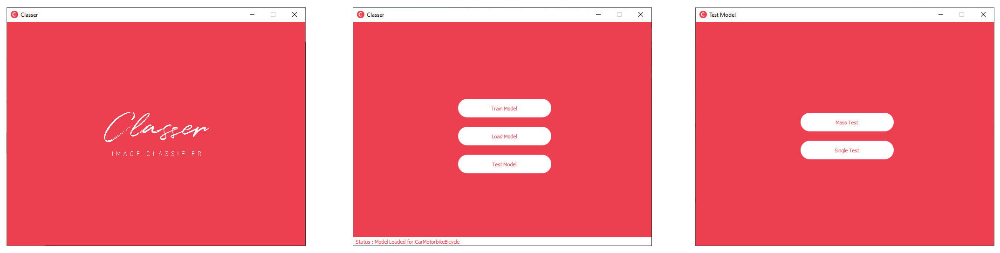
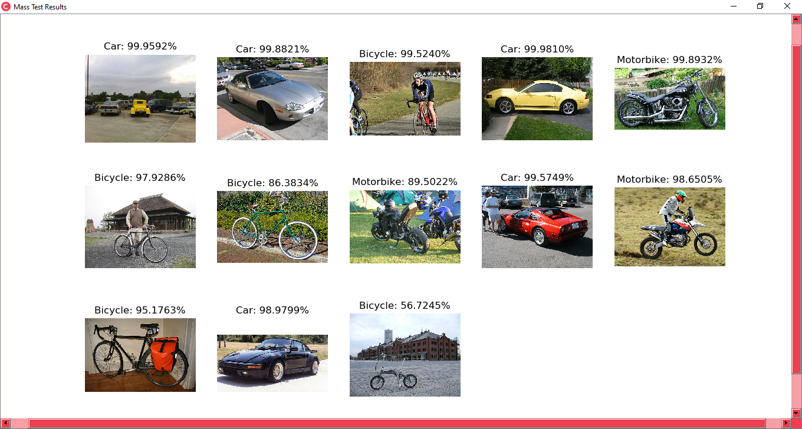

# Classer-Image-Classifier
A generalized image classifier using convolutional neuaral network with a graphical user interface.





### Required Modules
* PyQt5
* Keras
* Tensorflow
* PIL
* Numpy
* SkImage
* Matplotlib

### Instructions

The data set should be in the form of :

```
DATASET
       \
       train
           \
          class1
               \
               image1.jpg
               image2.jpg
               image3.jpg
               ...
               
          class2
               \
               image1.jpg
               image2.jpg
               image3.jpg
               ...
          class3
               \
               image1.jpg
               image2.jpg
               image3.jpg
               ...
        ...
          
      \
       validation
               \
               class1
                    \
                    image1.jpg
                    image2.jpg
                    image3.jpg
                    ...

               class2
                    \
                    image1.jpg
                    image2.jpg
                    image3.jpg
                    ...
               class3
                    \
                    image1.jpg
                    image2.jpg
                    image3.jpg
                    ...
        ...
```                
#### Example
```
CatvsDog
       \
       train
            \
             Cat
                \
                img1.jpg
                img2.jpg
                ...
            \
             Dog
                \
                img1.jpg
                img2.jpg
                 ...
        \
        validation
                  \
                   Cat
                      \
                      img1.jpg
                      img2.jpg
                      ...
                  \
                   Dog
                      \
                      img1.jpg
                      img2.jpg
                      ...
```
Note : All images must be in .jpg .png or .bmp | It is recommended to have a 80-20 or 70-30 split on the number of images for train and validation for any class.


* *Launch the program using Classer.pyw*

### 1. Train Model
It asks you to choose the directory of a data set, which needs to be in the format described above. After getting trained from the data set it will save the weights as 'model.h5' in the directory of the data set itself.

### 2. Load Model
It also asks you to choose the directory of a data set. On doing that it loads the weights for that particular data set saved as 'model.h5' in that directory.

### 3. Test Model
After loading the model you can use this feature to test it.
It gives you 2 options :
1. Mass Test : It asks you to choose the folder with the (mixed) test images and then displays all of them in a window with predicted labels and their likelihood percentage.
2. Single Test : It asks you to just choose a single image and then displays it with the likelihood of all the classes with the most probable one inside square brackets [ ].
